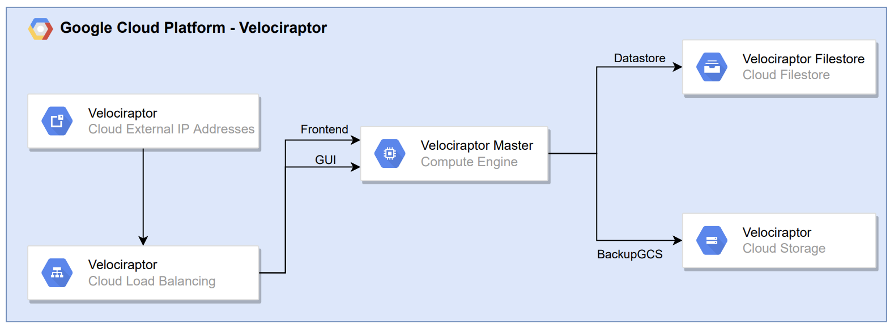

# THIS PROJECT IS ARCHIVED (see 'Known issues and limitations' before using the Terraform configuration)

[](https://gitlab.com/Zawadidone/dfir-lab/commits/main)
[](https://eurocyber.nl)

# DFIR Lab

[Blogpost - Automating DFIR using Cloud services](https://zawadidone.nl/automating-dfir-using-cloud-services/)

**NOTE**: Before using this project in production please read the full Terraform configuration. This project is just a proof of concept for a school assignment made using a student account with free GCP credits and a few Velociraptor clients for testing purposes.

The goal of this project is to create a DFIR Lab in the Cloud by using the elasticity, scalability and availability of Cloud services. I am a fan of GCP that's why I am using their services to deploy this lab, but this project can also be created for AWS, Azure or any other Cloud provider with a variation of Cloud services.

The lab can be used in a case where you as an Incident Responder want to analyze Plaso Timelines of Windows systems. 

1. Hunt for compromised systems using various of Velociraptor hunts (My favorite for ransomware investigations is the artifact [Windows.Search.FileFinder](https://velociraptor.velocidex.com/digging-for-files-with-velociraptor-a1c0a21e242b) to search for ransom notes).
2. Acquire forensiscs artifacts of compromised systems with the Velociraptor artifact KapeFiles.Targets.
3. Process the forensic artifacts with Plaso.
4. Upload the timelines to Timesketch.
5. Analyse the timelines in Timesketch.

NOTE: Steps 2, 3 and 4 are performed independently of each other for each system using GCP Pub/Sub and Cloud Functions.

In the diagram below the flow is shown:


This project is inspired by:

* [https://github.com/ReconInfoSec/velociraptor-to-timesketch](https://github.com/ReconInfoSec/velociraptor-to-timesketch)
* [https://github.com/forseti-security/osdfir-infrastructure](https://github.com/forseti-security/osdfir-infrastructure)

## How to use the lab

Prerequisites:

* Terraform
* Set up [GCP project](https://registry.terraform.io/providers/hashicorp/google/latest/docs)
* Two DNS A records for example: velociraptor.lab.example.com and timesketch.lab.example.com
* [Elastic Cloud account with API KEY](https://registry.terraform.io/providers/elastic/ec/latest/docs)

### Terraform

1. Initialize Terraform:
    `terraform init`
2. Fill in the environments.tfvars file with the following variables:

    ``` bash
    gcp_project  = "evident-zone-335315"
    gcp_region   = "europe-west4"
    gcp_zone   = "europe-west4-a"
    project_name = "rotterdam"
    domain_name  = "lab.zawadidone.nl"
    gcp_timesketch_machine_type_web = "c2-standard-4"
    gcp_timesketch_machine_type_worker = "c2-standard-4"
    ````

3. Log in to GCP:

    `gcloud auth application-default login`
4. Plan the Terraform configuration.

    `terraform plan -var-file=environments.tfvars`
5. Apple the Terraform configuration. The provisioning of the Google-managed certificates, File store's and SQL databases can take longer than 15 minutes.

    `terraform apply  -var-file=environments.tfvars`
6. Set the external IP addresses used by Velociraptor and Timesketch in your DNS A records.
7. Add the [Private Service Connect id](https://www.elastic.co/guide/en/cloud/current/ec-traffic-filtering-psc.html#ec-private-service-connect-allow-from-psc-connection-id) for the Elasticsearch deployment.
8. Use the Velociraptor and Timesketch passwords to log in using the username admin.

   ```bash
   terraform output velociraptor_password
   terraform output timesketch_password
   ```

Because I use this project on GCP with limited credits I always destroy the configuration after developing it.

`terraform destroy -var-file=environments.tfvars  -auto-approve`

### Debug issues

If on of the compute instances doesn't work, because of a bug in the startup script. The service responsible for this can be shown like this:

```bash
sudo journalctl -u google-startup-scripts.service # show log for debugging purposes
/usr/bin/google_metadata_script_runner startup # execute startup script again
sudo docker restart timesketch-web # restart timesketch which is stuck
```

**Timesketch**

Sometimes Timesketch shows errors like shown below while uploading timelines.

```bash
[2022-03-18 14:03:19,553] timesketch.lib.sigma/ERROR None # at the start
[2022-03-17 21:16:27 +0000] [10] [ERROR] Socket error processing request. # after uploading timeline using the gui
```

### Start the hunts

1. Login to Timesketch and create a sketch with the ID 1.
2. Login to Velociraptor.
3. Deploy Velociraptor [clients](https://docs.velociraptor.app/docs/deployment/clients/) using the configuration and executables added to the Google Storage Bucket in the folder `velociraptor-clients`.
4. Open Server Event Monitoring, select the artifact Server.Utils.BackupGCS and configure the following parameters:
    * ArtifactNameRegex: `Windows.KapeFiles.Targets`
    * Bucket: `Bucket name`
    * Project: `Project ID`
    * GCSKey: Add key to the service account `project_name`-velociraptor in GCP console and paste in the field. [https://velociraptor.velocidex.com/triage-with-velociraptor-pt-3-d6f63215f579](https://velociraptor.velocidex.com/triage-with-velociraptor-pt-3-d6f63215f579)
5. Configure Hunt
6. Select Artifact `Windows.KapeFiles.Targets`
7. Select the following parameters:
    * UseAutoAccessor
    * VSSAnalsyis
    * _SANS_Triage
    * DontBeLazy
8. Specify the following Resources:
    * Max Execution Time in Seconds: 999999999
9. Review the hunt
10. Launch and run the hunt
11. Wait before the Pub/Sub processing has processed the hunt collections and timelines
12. Go to Timesketch and analyse the new timelines.

## Components

The project uses the following software packages with the corresponding licenses:

| Project | License  |
|---|---|
| [Velociraptor](https://github.com/Velocidex/velociraptor) | [AGPLv3](https://github.com/Velocidex/velociraptor/blob/master/LICENSE)  |
| [Timesketch](https://github.com/google/timesketch) | [Apache License 2.0](https://github.com/google/timesketch/blob/master/LICENSE) |

### [Velociraptor](https://docs.velociraptor.app/docs/)

The current setup only supports Velociraptor with a single node setup. But is possible to add minion nodes to the [frontend](
https://docs.velociraptor.app/docs/deployment/cloud/multifrontend/) backend services and add the single master to the gui backend services. This way the clients connect to minions nodes (Frontend) and the analyst to the master node (GUI).

Scaling options:

* Adjust the instance type used by Velociraptor
* Add Velociraptor minions which can take care of the Frontend backend service by implementing multi-frontend
* Change the Filestore tier



### Processing (Pub/Sub)


Scaling options:

* Adjust the instance type used by Plaso 

### Timesketch

Scaling options

* Adjust the instance types used by the Timesketch web and worker instances, Elasticsearch, PostgreSQL or Redis
* Increase the target size of the backend services timesketch-web and timesketch-worker
* Change the Filestore tier


## Known issues and limitations

* Use auto scaling and healing for the Timesketch web and worker ([https://github.com/radeksimko/terraform-examples/blob/master/google-two-tier-scalable/main.tf#L72]( https://github.com/radeksimko/terraform-examples/blob/master/google-two-tier-scalable/main.tf#L72)).
* Increase memory used by Plaso in the modules processing and timesketch ([https://github.com/google/timesketch/blob/master/data/timesketch.conf#L171](https://github.com/google/timesketch/blob/master/data/timesketch.conf#L171)).
* Elastic Traffic filter randomly disappears from the Elastic Cloud dashboard which breaks Timesketch, but can be resolved by setting the option again.
* Use Velociraptor hunts for Linux and Mac OS systems which can be processed by Plaso.
* Using this setup with 10k production clients to test the scaling of the used Cloud services and the processing Pub/Sub implementation.
* Above [10-15K clients](https://velociraptor.velocidex.com/scaling-velociraptor-57acc4df76ed) the configuration should use the [multifrontend](https://docs.velociraptor.app/docs/deployment/cloud/multifrontend/) feature.
* Add [Windows](https://github.com/Velocidex/velociraptor/blob/master/artifacts/definitions/Windows/Memory/Acquisition.yaml) and [Linux](https://docs.velociraptor.app/exchange/artifacts/pages/linuxmemoryacquisition/) memory hunts to Velociraptor and process this with the [Volatitiy Timeline feature](https://www.alexanderjaeger.de/autotimeliner-to-cyberchef-to-timesketch/).
* Default all used VM instances have an outgoing internet connection to install software packages.
* Create VM images with the required packages already installed.
* The startup scripts contain passwords.
* Monitor the flow from the Velociraptor bucket until Timesketch with an alert if something fails in the processing.
* The Timesketch load balancer HTTP response location returns http:// instead of https://
* Add an object name prefix to the plaso timelines to exclude from Cloud function execution [https://registry.terraform.io/providers/hashicorp/google/latest/docs/resources/storage_notification#object_name_prefix](https://registry.terraform.io/providers/hashicorp/google/latest/docs/resources/storage_notification#object_name_prefix).
* The region of the Cloud function is [hardcoded](modules/processing/main.tf#L85).
* Add Buckets to upload CSV and JSON files with different formats [https://timesketch.org/guides/user/import-from-json-csv/](https://timesketch.org/guides/user/import-from-json-csv/).
