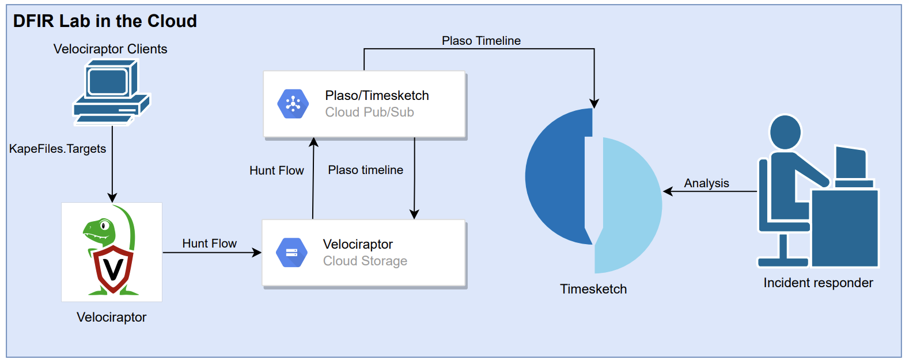
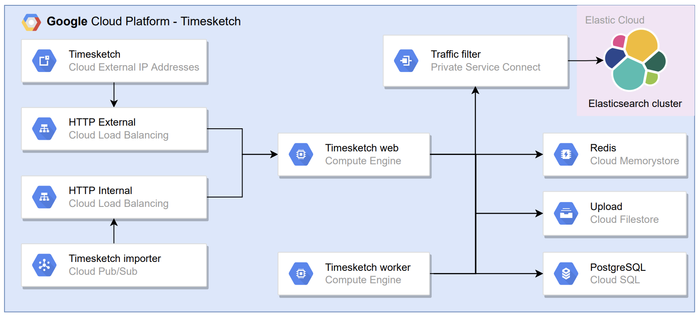

# DFIR Lab (Still in development)

**NOTE**: Before using this project in production please read the full Terraform configuration. This project is just a proof of concept for a school assignment made using a student account with free GCP credits and a few Velociraptor clients for testing purposes.

The goal of this project is to create a DFIR Lab in the Cloud by using the elasticity, scalability and availability of Cloud services. I am a fan of GCP that's why I am using their services to deploy this lab, but this project can also be created for AWS, Azure or any other Cloud provider with a variation of Cloud services.

The lab can be used in a case where you as an Incident Responder want to analyze Plaso Timelines of Windows systems. In the diagram below the flow is shown:



This project is inspired by:

* [https://github.com/ReconInfoSec/velociraptor-to-timesketch](https://github.com/ReconInfoSec/velociraptor-to-timesketch)
* [https://github.com/forseti-security/osdfir-infrastructure](https://github.com/forseti-security/osdfir-infrastructure)

## How to use the lab

Prerequisites:

* Terraform
* Set up [GCP project](https://registry.terraform.io/providers/hashicorp/google/latest/docs)
* Two DNS A records for example: velociraptor.lab.example.com and timesketch.lab.example.com
* [Elastic Cloud account with API KEY](https://registry.terraform.io/providers/elastic/ec/latest/docs)

### Terraform

1. Initialize Terraform:
    `terraform init`
2. Fill in the environments.tfvars file with the following variables:

    ``` bash
    gcp_project  = "evident-zone-335315"
    gcp_region   = "europe-west4"
    gcp_zone   = "europe-west4-a"
    project_name = "rotterdam"
    domain_name  = "lab.zawadidone.nl"
    gcp_timesketch_machine_type_web = "c2-standard-4"
    gcp_timesketch_machine_type_worker = "c2-standard-4"
    ````

3. Log in to GCP: 
    `gcloud auth application-default login`
4. Plan the Terraform configuration
    `terraform plan -var-file=environments.tfvars`
5. Apple the Terraform configuration. The provisioning of the Google-managed certificates, File store's and SQL databases can take longer than 15 minutes
    `terraform apply  -var-file=environments.tfvars`
6. Set the external IP addresses used by Velociraptor and Timesketch in your DNS A records
7. Add the [Private Service Connect](https://www.elastic.co/guide/en/cloud/current/ec-traffic-filtering-psc.html#ec-private-service-connect-allow-from-psc-connection-id) for Elasticsearch to the deployment
8. Use the Velociraptor and Timesketch passwords to log in using the username admin

   ```bash
   terraform output velociraptor_password
   terraform output timesketch_password
   ```

Because I use this project on GCP with limited credits I always destroy the configuration after developing it.
`terraform destroy -var-file=environments.tfvars  -auto-approve`

#### Debug issues

If on of the compute instances doesn't work, because of a bug in the startup script. The service responsible for this can be shown like this:

```bash
sudo journalctl -u google-startup-scripts.service # show log for debugging purposes
/usr/bin/google_metadata_script_runner startup # execute startup script again
```

**Timesketch**

Sometimes Timesketch shows errors like shown below while upload timelines.

```bash
[2022-03-18 14:03:19,553] timesketch.lib.sigma/ERROR None # at the start
[2022-03-17 21:16:27 +0000] [10] [ERROR] Socket error processing request. # after uploading timeline using the gui
Traceback (most recent call last):
  File "/usr/local/lib/python3.8/dist-packages/gunicorn/workers/sync.py", line 134, in handle
    req = six.next(parser)
  File "/usr/local/lib/python3.8/dist-packages/gunicorn/http/parser.py", line 41, in __next__
    self.mesg = self.mesg_class(self.cfg, self.unreader, self.req_count)
  File "/usr/local/lib/python3.8/dist-packages/gunicorn/http/message.py", line 187, in __init__
    super(Request, self).__init__(cfg, unreader)
  File "/usr/local/lib/python3.8/dist-packages/gunicorn/http/message.py", line 54, in __init__
    unused = self.parse(self.unreader)
  File "/usr/local/lib/python3.8/dist-packages/gunicorn/http/message.py", line 236, in parse
    self.headers = self.parse_headers(data[:idx])
  File "/usr/local/lib/python3.8/dist-packages/gunicorn/http/message.py", line 74, in parse_headers
    remote_addr = self.unreader.sock.getpeername()
OSError: [Errno 107] Transport endpoint is not connected
```

### Start the hunts

1. Login to Velociraptor
2. Deploy Velociraptor [clients](https://docs.velociraptor.app/docs/deployment/clients/) using the configuration and executables added to the Google Storage Bucket in the folder `velociraptor-clients`.
3. Open Server Event Monitoring and select the artefact Server.Utils.BackupGCS:
    * ArtifactNameRegex: `Windows.KapeFiles.Targets`
    * Bucket: `Bucket name`
    * Project: `Project ID`
    * GCSKey: Add key to the service account `project_name-velociraptor` in GCP console and paste in the field. [https://velociraptor.velocidex.com/triage-with-velociraptor-pt-3-d6f63215f579](https://velociraptor.velocidex.com/triage-with-velociraptor-pt-3-d6f63215f579)
4. Configure Hunt
5. Select Artifact `Windows.KapeFiles.Targets`
6. Select the following parameters:
    * UseAutoAccessor
    * VSSAnalsyis
    * _SANS_Triage
    * DontBeLazy
7. Specify the following Resources:
    * Max Execution Time in Seconds: 999999999
8. Review the hunt
9. Launch and run the hunt
10. ????
11. Go to Timesketch and analyse the new timelines.

## Components

The project uses the following software packages with the corresponding licenses:

| Project | License  |
|---|---|
| [Velociraptor](https://github.com/Velocidex/velociraptor)  | [ AGPLv3](https://github.com/Velocidex/velociraptor/blob/master/LICENSE)  |   |
| [Timesketch](https://github.com/google/timesketch)  | [Apache License 2.0](https://github.com/google/timesketch/blob/master/LICENSE)  | 

### [Velociraptor](https://docs.velociraptor.app/docs/)

The current setup only supports Velociraptor with a single node setup. But is possible to add minion nodes to the [frontend](
https://docs.velociraptor.app/docs/deployment/cloud/multifrontend/) backend services and add the single master tot the gui backend services. This way the clients connect to minions nodes (Frontend) and the analyst to the master node (GUI).

Scaling options:

* Adjust the instance type used by Velociraptor
* Add Velociraptor minions which can take care of the Frontend backend service by implementing multi-frontend
* Change the Filestore tier


### Processing (Pub/Sub)

TODO

### Timesketch

Scaling options

* Adjust the instance types used by the Timesketch web and worker instances, Elasticsearch, PostgreSQL or Redis
* Increase the target size of the backend services timesketch-web and timesketch-worker
* Change the Filestore tier



## Known issues or limitations

* Elastic Traffic filter randomly disappears which breaks Timesketch. 
* Using this setup with 10k production clients to test the scaling of the used Cloud services and the processing Pub/Sub implementation.
* Above [10-15K clients](https://velociraptor.velocidex.com/scaling-velociraptor-57acc4df76ed) the configuration should use the [multifrontend](https://docs.velociraptor.app/docs/deployment/cloud/multifrontend/) feature.
* Place the Velociraptor GUI (`/gui/*`) and Timesketch behind a [Identity-Aware Proxy](https://cloud.google.com/iap).
* Use Google OAuth SSO instead of a single admin user for [Velociraptor](https://docs.velociraptor.app/docs/deployment/cloud/#configuring-google-oauth-sso) and [Timesketch](https://github.com/google/timesketch/blob/master/data/timesketch.conf#L53).
* Use Velociraptor hunts for Linux and Mac OS systems which can be processed by Plaso.
* Add [Windows](https://github.com/Velocidex/velociraptor/blob/master/artifacts/definitions/Windows/Memory/Acquisition.yaml) and [Linux](https://docs.velociraptor.app/exchange/artifacts/pages/linuxmemoryacquisition/) memory hunts to Velociraptor and process this with the [Volatitiy Timeline feature](https://www.alexanderjaeger.de/autotimeliner-to-cyberchef-to-timesketch/).
* Using Cloud Run/Kubernetes instead of the Compute Engine.
* The applications Velociraptor and Timesketch are deployed using the Compute Engine. But these can also be deployed using Cloud Run for these custom Docker images with entry points that look like the startup scripts are needed.
* Default all used VM instances have an outgoing internet connection to install software packages.
* The Timesketch web instances can only use a single WSGI worker https://github.com/google/timesketch/issues/637
* For production use change the Filestore tier to BASIC_SSD ([Velociraptor](modules/velociraptor/main.tf#L253), [Timesketch](modules/timesketch/main.tf#L87))

## ToDo

* add processing module (GCP Pub/SUB).
* Add CI build to Gitlab with different entry point which logs to stdout and stderr and check if the logs end up in Stackdriver. https://github.com/google/timesketch/blob/master/docker/release/build/docker-entrypoint.sh, https://docs.gunicorn.org/en/stable/settings.html#accesslog, https://docs.gunicorn.org/en/stable/settings.html#accesslog.
* Stress test with compute-optimized instance types and SSD filestores.
* Use auto scaling and healing for the Timesketch web and worker https://github.com/radeksimko/terraform-examples/blob/master/google-two-tier-scalable/main.tf#L72
* Reacreate Velociraptor master and/or Timesketch web if unhealthy
* Make sure the disk used by Velociraptor is not deleted after reboot and exit the startup script if the installation is already done.
* Make the target size of Timesketch web and worker variable.
* The Timesketch load balancer should return https:// instead of http:// in the response.
